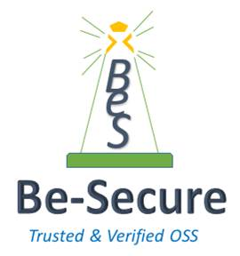

 ** Be-Secure is an umbrella of open source security projects …..**

###  Get started now  

Understand the relevance of Be-Secure project, what it offers for you. (provide the link to the Gettingstarted.md file)

###  Seven stage Be-Secure security assessment 

Leverage Be-Secure community edition security assessment process to secure your open source projects. (provide the link to the Seven stage Be-Secure security assessment.md file)

###  OSS projects 

Refer the list of OSS projects we track and contribute to. (provide the link to the oss projects.md file)

###  Contribute 

Use customized environments & share feedback, build new customized environments and more… (provide the link to the how to contribute.md file)

###  Open Source Security Tech Stack

Be-Secure open source security stack is a classification of technologies for enabling open-source developers to identify & leverage suitable BeSman environments that have been security tested by the Be-Secure open-source community.