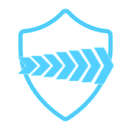
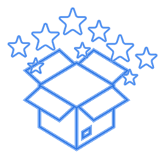
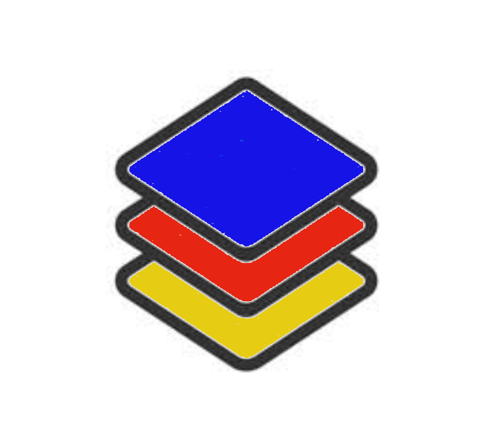

## ** Be-Secure is an umbrella of open source security projects …..**

###  [Get started now](./besec_info/tracked_projects.md)  

Understand the relevance of Be-Secure project, what it offers for you. 

###  [Seven stage Be-Secure security assessment](./besec_info/Security_assessment.md) 

Leverage Be-Secure community edition security assessment process to secure your open source projects. 

###  [OSS projects](./besec_info/tracked_projects.md) 

Refer the list of OSS projects we track and contribute to. 

###  [Contribute](./besec_info/Project_contribute.md) 

Use customized environments & share feedback, build new customized environments and more… 

###  [Open Source Security Tech Stack](./besec_info/Tech_stack.md)

Be-Secure open source security stack is a classification of technologies for enabling open-source developers to identify & leverage suitable BeSman environments that have been security tested by the Be-Secure open-source community.